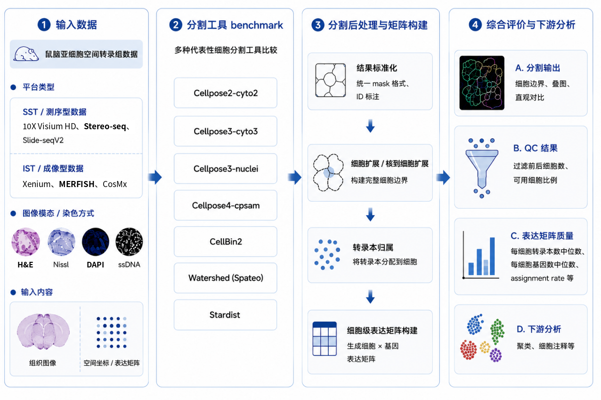

# Workflow

## Overview

This document summarizes the overall workflow used in this project.

The analysis started from spatial transcriptomics data and corresponding tissue or staining images. Different cell segmentation tools were applied to generate segmentation masks. The masks were then used to assign transcripts to cells, construct cell-level expression matrices, calculate QC metrics, and generate visualization figures for comparison.

## Main Steps

### 1. Input Data Preparation

The main input files included:

* tissue or staining images in `.tif` format;
* transcript count tables in `.parquet` format.

For some workflows, the transcript table was converted from `.parquet` to GEM format before running the segmentation or matrix-processing software.

### 2. Cell Segmentation

Several segmentation tools were tested in this project, including Cellpose, CellBin2, Spateo watershed, and StarDist.

Different tools were run in different ways. Some methods used batch scripts, while others were run through command-line records or interactive Python commands.

### 3. Mask Processing and Transcript Assignment

The segmentation masks were used to assign transcript coordinates to segmented regions.

For each cell or ROI, transcript counts were aggregated by gene to construct a cell-level expression matrix.

### 4. Expression Matrix Construction

The assigned transcript counts were converted into `.h5ad` format for downstream analysis.

The `.h5ad` files included:

* cell-by-gene count matrix;
* cell-level QC metrics;
* gene-level summary information;
* spatial coordinates stored in `adata.obsm["spatial"]`.

### 5. QC and Visualization

Basic QC metrics were calculated and visualized, including:

* total counts;
* detected genes;
* mitochondrial percentage;
* mapped cell numbers.

Spatial visualization and mapping overview plots were generated to check whether images, masks, transcript spots, and mapped cells were spatially consistent.

## Notes

This repository records representative scripts, environment files, and workflow notes.

Large input data, complete masks, full output directories, generated `.h5ad` files, figures, and logs are not stored in this repository.

---

# Workflow 中文说明

## 概述

本文档总结本项目的整体分析流程。

本项目从空间转录组数据及其对应的组织图像或染色图像出发，使用不同细胞分割工具生成 segmentation mask。随后基于 mask 将转录本归属到细胞，构建细胞级表达矩阵，计算 QC 指标，并生成用于比较和检查的可视化结果。流程图见上方 overvie 部分

## 主要步骤

### 1. 输入数据准备

本项目主要使用的输入文件包括：

* `.tif` 格式的组织图像或染色图像；
* `.parquet` 格式的转录本计数表。

部分软件或流程需要 GEM 格式的转录本表，因此需要先将 `.parquet` 文件转换为 GEM 文件。

### 2. 细胞分割

本项目测试了多个细胞分割工具，包括 Cellpose、CellBin2、Spateo watershed 和 StarDist。

不同工具的运行方式并不完全相同。部分方法使用批处理脚本运行，部分方法主要通过命令记录或交互式 Python 命令运行。

### 3. Mask 处理与转录本归属

分割得到的 mask 被用于将转录本坐标归属到对应的细胞或 ROI。

随后按照 cell / ROI 和 gene 对转录本计数进行汇总，构建细胞级表达矩阵。

### 4. 表达矩阵构建

转录本归属结果被转换为 `.h5ad` 格式，用于后续分析。

`.h5ad` 文件中主要包括：

* 细胞 × 基因的表达矩阵；
* 细胞层面的 QC 指标；
* 基因层面的统计信息；
* 存储在 `adata.obsm["spatial"]` 中的空间坐标。

### 5. QC 与可视化

本项目计算并展示了基础 QC 指标，包括：

* total counts；
* detected genes；
* mitochondrial percentage；
* mapped cell numbers。

同时生成空间分布图和 mapping overview 图，用于检查图像、mask、转录本点位和已映射细胞之间的空间一致性。

## 说明

本仓库主要记录代表性脚本、环境文件和流程说明。

大型输入数据、完整 mask、完整输出目录、生成的 `.h5ad` 文件、图片和日志文件不保存在本仓库中。
